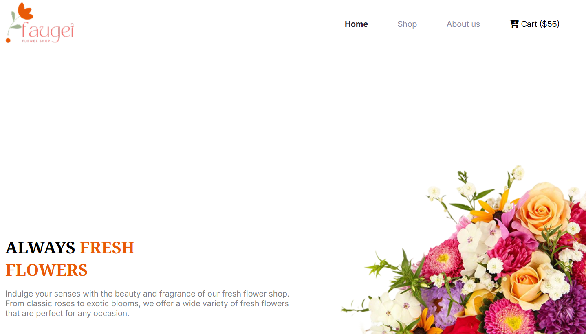
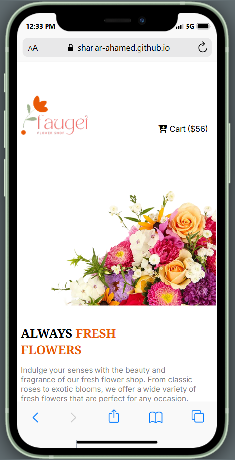

# 🌸 Responsive Flowers

A modern, fully responsive flower shop website built with HTML and CSS. This project demonstrates best practices in responsive design, clean UI, and accessibility for both desktop and mobile users.

---

## 🚀 Live Demo
[View on GitHub Pages](https://shariar-ahamed.github.io/Responsive-Flowers/)

---

## 📸 Screenshots

### 💻 Computer View


### 📱 Mobile View


---

## ✨ Features
- Responsive layout for all devices
- Modern, clean design
- Interactive navigation bar
- Product cards with add-to-cart button
- Attractive deals and offers section
- Newsletter subscription
- Social media links in footer

---

## 🛠️ Technologies Used
- HTML5
- CSS3 (Flexbox, Grid, Media Queries)
- Google Fonts
- Font Awesome Icons

---

## 📂 Folder Structure
```
Responsive-Flowers/
├── assets/
│   ├── Computer_view.png
│   ├── Mobile_View.png
│   ├── ...other images
├── index.html
├── style.css
└── readme.md
```

---

## 📧 Contact
For any queries or feedback, feel free to reach out via [GitHub](https://github.com/Shariar-Ahamed).

---

## 📝 License
This project is open source and available under the MIT License.